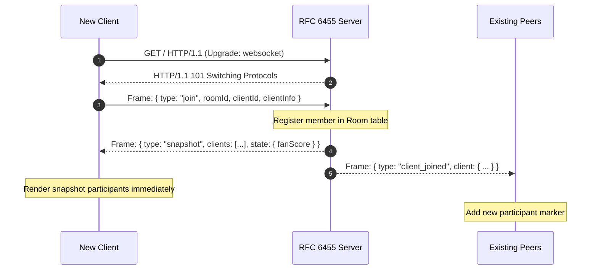
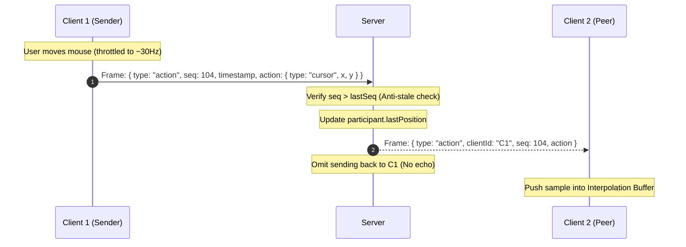
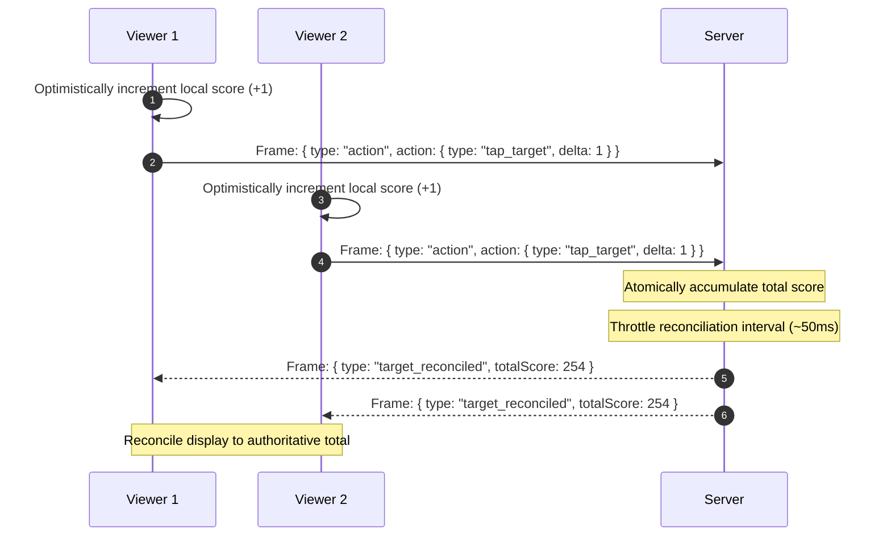

# System Architecture & Technical Deep-Dive

This document details the internal architecture, mathematical formulations, protocol layout, and scale-out strategy of the Real-Time Multiplayer Sync Engine.

---

## 1. System Topology & Component Model

The system is partitioned into cleanly decoupled layers, separating low-level byte transport from the high-level application domain:

```mermaid
graph TD
    subgraph Client Application
        DOM[User Input / Mouse Tracking]
        Throttle[Adaptive Rate Throttler]
        TransClient[Raw WebSocket Client]
        JitterBuf[Render Buffer & Jitter Buffer]
        Interp[Hermite Cubic Interpolator]
        Extrap[Velocity Dead-Reckoning]
        Canvas[60fps Canvas HiDPI Renderer]
        HypeUI[Collaborative Hype Component]

        DOM -->|Raw Mousemove| Throttle
        DOM -->|Tap / Emoji| TransClient
        Throttle -->|Throttled Updates| TransClient
        TransClient -->|Incoming Action| JitterBuf
        JitterBuf -->|Samples| Interp
        JitterBuf -->|Starvation| Extrap
        Interp -->|Interpolated Px| Canvas
        Extrap -->|Extrapolated Px| Canvas
        TransClient -->|Reconciled State| HypeUI
    end

    subgraph Server Runtime
        HTTP[HTTP Upgrade Listener]
        RFC[RFC 6455 Frame Parser & Encoder]
        Router[Room Router & Dispatcher]
        RoomMgr[Room State & Presence Manager]
        Recon[State Aggregator & Reconciler]

        HTTP -->|Upgrade 101| RFC
        RFC -->|Unmasked UTF-8| Router
        Router -->|Validated Message| RoomMgr
        RoomMgr -->|O(N) Fan-Out| RFC
        RoomMgr -->|Tap Deltas| Recon
        Recon -->|Periodic Broadcast| RFC
    end

    TransClient <==>|TCP Frames / Opcode 0x1| RFC
```

---

## 2. Low-Level Transport: Zero-Dependency RFC 6455 Framing

The server bypasses third-party libraries (`ws`, `socket.io`) and interacts directly with Node's native `node:net` and `node:crypto` modules.

### 2.1 The WebSocket Handshake
When an incoming HTTP request presents headers:
- `Upgrade: websocket`
- `Connection: Upgrade`
- `Sec-WebSocket-Key: <Client-Key>`
- `Sec-WebSocket-Version: 13`

The server computes the verification digest according to RFC 6455 §4.2:
$$\text{AcceptKey} = \text{Base64}\Big(\text{SHA-1}\big(\text{ClientKey} + \texttt{"258EAFA5-E914-47DA-95CA-C5AB0DC85B11"}\big)\Big)$$

The connection socket is detached from the HTTP server pipeline and responds with:
```http
HTTP/1.1 101 Switching Protocols
Upgrade: websocket
Connection: Upgrade
Sec-WebSocket-Accept: <AcceptKey>
```

### 2.2 Frame Deconstruction & Masking
Every client-to-server frame is masked with a 4-byte XOR cipher (RFC 6455 §5.3):
```
 0                   1                   2                   3
 0 1 2 3 4 5 6 7 8 9 0 1 2 3 4 5 6 7 8 9 0 1 2 3 4 5 6 7 8 9 0 1
+-+-+-+-+-------+-+-------------+-------------------------------+
|F|R|R|R| opcode|M| Payload len |    Extended payload length    |
|I|S|S|S|  (4)  |A|     (7)     |             (16/64)           |
|N|V|V|V|       |S|             |   (if payload len==126/127)   |
+-+-+-+-+-------+-+-------------+ - - - - - - - - - - - - - - - +
|     Extended payload length continued, if payload len == 127  |
+ - - - - - - - - - - - - - - - +-------------------------------+
|                               |Masking-key, if MASK set to 1  |
+-------------------------------+-------------------------------+
| Masking-key (continued)       |          Payload Data         |
+-------------------------------- - - - - - - - - - - - - - - - +
```

- **Masking Decoding**:
  $$\text{Payload}[i] = \text{FrameBytes}[i] \oplus \text{MaskKey}[i \pmod 4]$$
- **Payload Length Encodings**:
  - Length $< 126$: represented directly in byte 1 (bits 0–6).
  - Length $= 126$: payload length stored in the subsequent 2 bytes (`readUInt16BE(2)`).
  - Length $= 127$: payload length stored in the subsequent 8 bytes (`readBigUInt64BE(2)`).
- **Server Frame Construction**:
  Server-to-client frames omit the mask bit (`MASK = 0`), reducing frame overhead by 4 bytes per update.

---

## 3. Client Interpolation, Extrapolation & Jitter Buffer

### 3.1 The Timeline Model

```
Authoritative Updates:
  ───[P0 (t=0ms)]───────────────[P1 (t=33ms)]───────────────[P2 (t=66ms)]───► Real Time (t)
                                                      ▲
                                                      │
Render Sampling Point:                                │
  ────────────────────────────────────[Render t=15ms]─┴─────────────────────►
                                        (Lag = 51ms)
```

By rendering entities at $t_{\text{render}} = t_{\text{client}} - \text{renderDelayMs}$ ($\Delta_{\text{delay}} = 60\text{ms}$), the client samples within a known segment $[P_k, P_{k+1}]$.

### 3.2 Smoothstep Hermite Interpolation
Linear interpolation exhibits sharp angular changes in velocity at sample boundaries ($\frac{d^2x}{dt^2} = \infty$). To produce natural motion, we evaluate a cubic Hermite smoothstep polynomial:
$$\alpha = \frac{t_{\text{render}} - t_k}{t_{k+1} - t_k}, \quad \alpha \in [0, 1]$$
$$S(\alpha) = 3\alpha^2 - 2\alpha^3$$
$$P(t) = P_k + (P_{k+1} - P_k) \cdot S(\alpha)$$

At boundary points $\alpha = 0$ and $\alpha = 1$, the first derivative transitions smoothly ($\frac{dS}{d\alpha}\Big|_{0} = 0, \frac{dS}{d\alpha}\Big|_{1} = 0$), eliminating instantaneous directional snapping.

### 3.3 Dead-Reckoning Extrapolation under Packet Loss
When network jitter delays packet arrival beyond $t_{\text{render}}$:
1. The engine computes the velocity vector from the two most recent authoritative samples:
   $$\vec{v} = \frac{P_{\text{latest}} - P_{\text{prev}}}{t_{\text{latest}} - t_{\text{prev}}}$$
2. The predicted coordinate is projected forward:
   $$P_{\text{extrapolated}} = P_{\text{latest}} + \vec{v} \cdot \Delta t \cdot e^{-\gamma \cdot \Delta t}$$
   where $\gamma = 0.015$ serves as a friction coefficient.
3. If $\Delta t > 120\text{ms}$, extrapolation halts to avoid false positional drift.

### 3.4 Error Blending on Trajectory Re-convergence
When the delayed packet $P_{\text{real}}$ finally arrives:
$$\vec{E} = P_{\text{projected}} - P_{\text{real}}$$
Rather than teleporting to $P_{\text{real}}$, the error vector $\vec{E}$ is added to subsequent interpolated frames with an exponential decay factor:
$$P_{\text{display}}(t) = P_{\text{interp}}(t) + \vec{E} \cdot \max\left(0, 1 - \frac{t - t_{\text{arrival}}}{T_{\text{blend}}}\right)$$
where $T_{\text{blend}} = 60\text{ms}$.

---

## 4. Presence, Lifecycle & Sequence Diagrams

### 4.1 Client Join & State Snapshotting



### 4.2 Action Relay (Zero Sender Echo)



### 4.3 Collaborative Conflict Reconciliation



---

## 5. Horizontal Scale-Out Strategy (Multi-Server Clusters)

While a single Node process easily handles 5,000 concurrent WebSockets, scaling to hundreds of thousands of simultaneous viewers across broadcast events requires horizontal distribution.

### 5.1 Architecture for 100k+ Concurrent Viewers

```mermaid
graph TD
    subgraph Edge Layer
        LB[Global Anycast Load Balancer / NGINX]
    end

    subgraph Application Tier
        Node1[Server Instance 1]
        Node2[Server Instance 2]
        Node3[Server Instance N]
    end

    subgraph State & Pub/Sub Fabric
        Redis[Redis 7 Cluster / Dragonfly DB]
        Shards[(Room Partition Channels)]
    end

    LB -->|Consistent Hash on roomId| Node1
    LB -->|Consistent Hash on roomId| Node2
    LB -->|Consistent Hash on roomId| Node3

    Node1 <==>|SUBSCRIBE / PUBLISH room:{id}| Redis
    Node2 <==>|SUBSCRIBE / PUBLISH room:{id}| Redis
    Node3 <==>|SUBSCRIBE / PUBLISH room:{id}| Redis
```

#### 1. Room-Level Affinity (Sticky Routing)
- The edge load balancer hashes incoming connections by `roomId`.
- All viewers of a given room land on the same node when room occupancy $< 2,000$. This preserves $O(N)$ local broadcast efficiency with zero inter-process overhead.

#### 2. Cross-Node Federation via Redis Pub/Sub
- When a room exceeds single-node capacity (e.g., 50,000 viewers in the same broadcast channel), multiple server nodes participate in the room.
- Cursors are batched into 33ms delta bundles on each server instance and published to a Redis channel `room:{roomId}:updates`.
- Peer instances receive the compressed bundle and fan it out to their locally connected subscribers.

#### 3. Delta Compression & Binary Encoding
- Moving from JSON to binary serialization (Protocol Buffers or FlatBuffers) reduces packet size from ~110 bytes to 14 bytes per cursor packet:
  ```
  [1 byte: Opcode] [4 bytes: ClientId Hash] [2 bytes: Seq] [2 bytes: X (UInt16)] [2 bytes: Y (UInt16)]
  ```
- This yields an **87% reduction in network bandwidth** across the server mesh.
